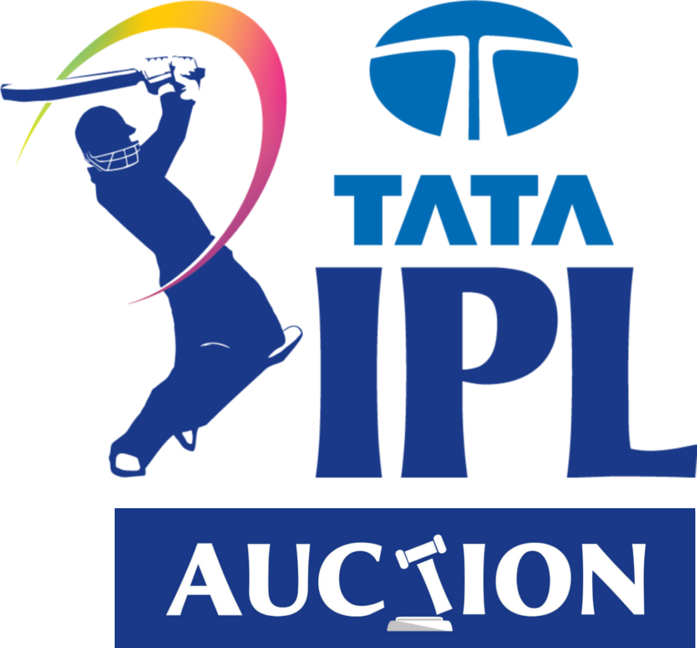

# IPL Player Auction Price Prediction and Analysis



## Overview

This repository contains the code, data, and analysis for predicting Indian Premier League (IPL) player auction prices using regression models. Additionally, the project includes in-depth analysis and correlation studies to understand the factors influencing player valuations.

## Table of Contents

- [Introduction](#introduction)
- [Dataset](#dataset)
- [Project Structure](#project-structure)
- [Usage](#usage)
- [Results](#results)
- [Analysis](#analysis)
- [Correlation Studies](#correlation-studies)
- [Contributing](#contributing)
- [License](#license)

## Introduction

In the world of cricket, the IPL player auction is a high-stakes event where teams bid for players to build their squads. This project aims to predict player auction prices using regression models, shedding light on the factors influencing valuations. Additionally, the project includes extensive analysis and correlation studies to gain insights into the auction dynamics.

## Dataset

The dataset used for this project includes player attributes, performance metrics, and auction prices. It encompasses a wide range of features, such as age, runs scored, batting strike rate, and more.

## Project Structure

├── data/ # Data files
│ ├── ipl_data.csv # IPL player data
├── notebooks/ # Jupyter notebooks
│ ├── IPL_Player_Prediction.ipynb # Main prediction notebook
│ ├── Auction_Analysis.ipynb # Analysis and correlation notebook
├── models/ # Trained model files (if applicable)
├── src/ # Source code
│ ├── data_preprocessing.py # Data preprocessing scripts
│ ├── regression_models.py # Regression model scripts
├── README.md # Project overview
└── requirements.txt # Dependencies

## Usage

1. Clone this repository:

   ```bash
   git clone https://github.com/yourusername/ipl-player-prediction.git

## Results
Prediction Models
Linear Regression Model:
RMSE: 87902.764
R2 Score: 96.371

Ridge Regression Model:
RMSE: 84222.506
R2 Score: 96.655

Random Forest Regression Model:
RMSE: 127589.38
R2 Score: 91.522

## Analysis
In addition to prediction models, the project includes comprehensive analysis of IPL player auctions, uncovering valuable insights into the valuation process.

## Correlation Studies
Detailed correlation studies are conducted to identify relationships between player attributes, performance metrics, and auction prices.

## Contributing
Contributions are welcome! If you have suggestions or improvements, please open an issue or create a pull request.

## License
This project is licensed under the MIT License.
